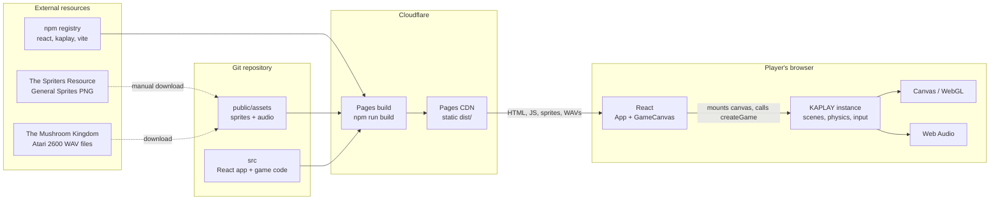
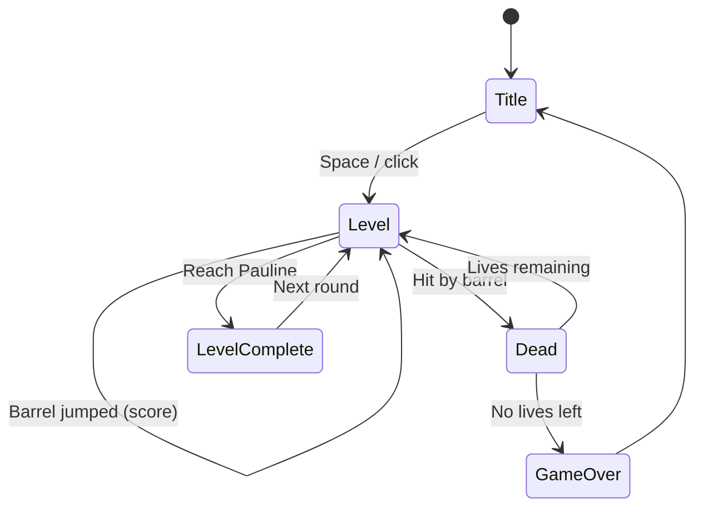

# Donkey Kong (Atari 2600) in React

A recreation of the 1982 Atari 2600 *Donkey Kong*, built with **React + KAPLAY** and hosted on **Cloudflare Pages**.

> Fan project for learning. Donkey Kong is a Nintendo property and the Atari 2600 port was made by Coleco; see [Asset licensing](#asset-licensing) before publishing.

## Stack

| Concern | Choice | Notes |
| --- | --- | --- |
| UI shell | React 19 + TypeScript | Owns the page, canvas element, and (later) HUD/menus/touch controls |
| Game engine | [KAPLAY](https://kaplayjs.com/) 3001 | Scenes, sprites, physics, input, audio. Runs with `global: false` |
| Bundler | Vite 8 | `npm run dev` / `npm run build` |
| Hosting | Cloudflare Pages | Static site: build output is `dist/` |
| Resolution | 160 × 192 logical | The Atari 2600 picture size, letterboxed and scaled with pixelated rendering |

## Resources

| Asset | Source | Where it lives |
| --- | --- | --- |
| Sprites ("General Sprites", 409×280 PNG) | [The Spriters Resource, asset 2110](https://www.spriters-resource.com/atari_2600/donkeykong/asset/2110/) | `public/assets/sprites/general.png` (**manual download**, not yet added) |
| Sound effects (jump, over, walk, die, victory) | [The Mushroom Kingdom, DK A2600 WAVs](https://themushroomkingdom.net/media/dk-a2600/wav) | `public/assets/audio/dk-a2600_*.wav` (added) |
| Game engine | [KAPLAY docs](https://kaplayjs.com/docs/) | npm dependency |

## Architecture

How the external services, the repo, and the runtime relate:



Runtime ownership: React owns the `<canvas>` element and its lifecycle (mount creates the KAPLAY instance, unmount calls `k.quit()`). KAPLAY owns everything drawn on the canvas. They talk only through `createGame(canvas)`; if the HUD moves into React later, add a small event bridge rather than sharing state directly.

### Game flow



Only `Title` and a placeholder `Level` exist today (`src/game/scenes/`).

## Project structure

```
.
├── index.html
├── wrangler.toml            # Cloudflare Pages config for `npm run deploy`
├── public/assets/
│   ├── audio/               # dk-a2600_{jump,over,walk,die,victory}.wav
│   └── sprites/             # put general.png here
└── src/
    ├── main.tsx             # React entry
    ├── App.tsx              # page layout
    ├── index.css
    └── game/
        ├── GameCanvas.tsx   # React <-> KAPLAY bridge (mount / cleanup)
        ├── createGame.ts    # kaplay() init, asset load, scene registration
        ├── constants.ts     # resolution, physics tuning, scene names
        ├── assets.ts        # sound + sprite loading
        └── scenes/          # title.ts, level.ts (placeholder)
```

## Getting started

```bash
nvm use          # Node 26 (see .nvmrc)
npm install
npm run dev      # http://localhost:5173
```

Other scripts: `npm run build`, `npm run preview`, `npm run typecheck`.

## Deploying to Cloudflare Pages

**Option A: Git integration (recommended).** In the Cloudflare dashboard, go to Workers & Pages > Create > Pages > Connect to Git, then set:

| Setting | Value |
| --- | --- |
| Framework preset | Vite (or None) |
| Build command | `npm run build` |
| Build output directory | `dist` |
| Environment variable | `NODE_VERSION` = `26` |

Every push to `main` deploys to production; other branches get preview URLs.

**Option B: Direct upload from your machine.**

```bash
npx wrangler login
npm run deploy
```

The first run asks you to create the Pages project (`donkeykong`, per `wrangler.toml`).

## Roadmap

- [x] **0. Scaffold**: Vite + React + KAPLAY, title scene, placeholder level with movement/jump/audio, builds clean
- [ ] **1. Sprites**: download `general.png`, slice into a KAPLAY atlas (Mario, Kong, barrels, Pauline, girders, ladders), add a debug scene that shows every frame
- [ ] **2. Level layout**: girders, ladders, tile-accurate collision, Mario climb/walk animations
- [ ] **3. Hazards**: Kong throwing barrels, barrel physics down girders, jump-over detection (`over` sound)
- [ ] **4. Game rules**: score, lives, HUD, death (`die`), level clear (`victory`), game over
- [ ] **5. Polish**: pixel font, on-screen touch controls for mobile, pause, high score in `localStorage`, mute toggle
- [ ] **6. Ship**: Cloudflare Pages project, custom domain, CI typecheck on PRs

## Asset licensing

The sprites and sounds are ripped from a commercial game, and neither source page states a license (the Spriters Resource page has none; The Mushroom Kingdom credits its contributor, The Blue Prophet). That is fine for a private learning project. Before making the deployed site public, decide whether to:

- keep the repo private and the site unlisted, or
- swap in original art/audio, or
- get permission from the rights holders.

Also credit the sprite ripper (Zeph) and sound contributor (The Blue Prophet) somewhere visible if you do publish.

## Known gaps

- The sprite sheet cannot be fetched by script (the Spriters Resource blocks direct download URLs), so add it by hand.
- KAPLAY's default font is blurry at 160 px wide; a bitmap pixel font is on the roadmap.
