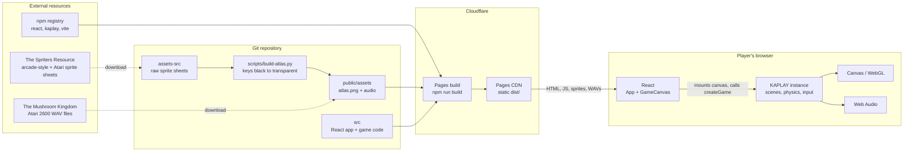
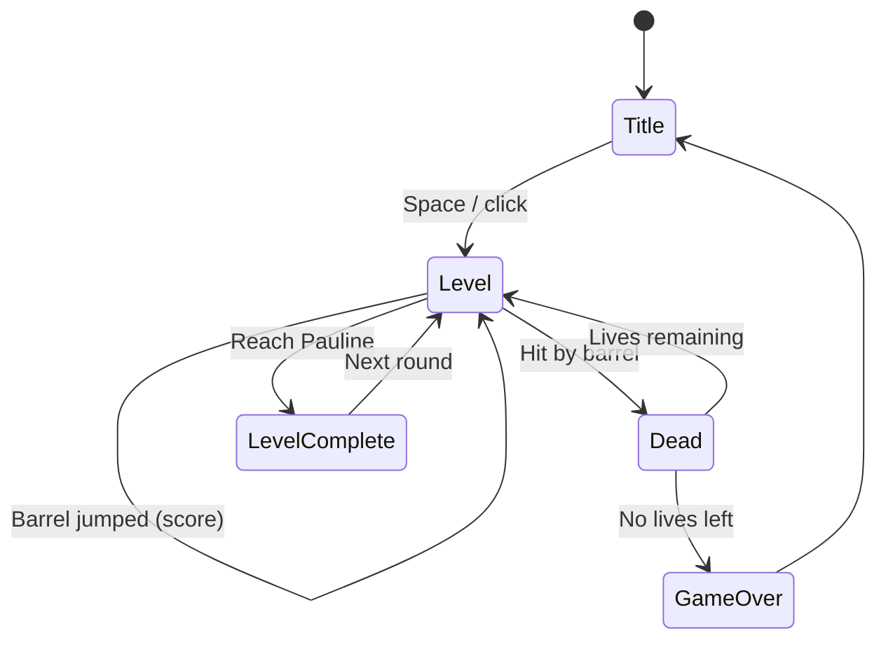

# Donkey Kong (Atari 2600) in React

A recreation of the 1982 Atari 2600 *Donkey Kong*, built with **React + KAPLAY** and hosted on **Cloudflare Pages**.

> Fan project for learning. Donkey Kong is a Nintendo property and the Atari 2600 port was made by Coleco; see [Asset licensing](#asset-licensing) before publishing.

## Stack

| Concern | Choice | Notes |
| --- | --- | --- |
| UI shell | React 19 + TypeScript | Owns the page, canvas element, and (later) HUD/menus/touch controls |
| Game engine | [KAPLAY](https://kaplayjs.com/) 3001 | Scenes, sprites, physics, input, audio. Runs with `global: false` |
| Bundler | Vite 8 | `npm run dev` / `npm run build` |
| Hosting | Cloudflare Pages | Static site: build output is `dist/` |
| Resolution | 224 × 256 logical | Arcade-style portrait playfield, letterboxed and scaled with pixelated rendering |
| Font | Press Start 2P (`@fontsource`) | Self-hosted, loaded at 8px so text stays crisp |

## Resources

| Asset | Source | Where it lives |
| --- | --- | --- |
| Arcade-style sprites (Kong, Mario, Pauline, barrels, fireballs, digits, lives, stages), 459×387 PNG, by **Nick edits** | [The Spriters Resource, asset 487599](https://www.spriters-resource.com/custom_edited/donkeykongcustoms/asset/487599/) | `assets-src/arcade-style.png`, built into `public/assets/sprites/atlas.png` (**in use**) |
| Original Atari 2600 sprites ("General Sprites", 409×280 PNG), ripped by **Zeph** | [The Spriters Resource, asset 2110](https://www.spriters-resource.com/atari_2600/donkeykong/asset/2110/) | `assets-src/general.png` (reference, not used yet) |
| Sound effects (jump, over, walk, die, victory), by **The Blue Prophet** | [The Mushroom Kingdom, DK A2600 WAVs](https://themushroomkingdom.net/media/dk-a2600/wav) | `public/assets/audio/dk-a2600_*.wav` |
| Game engine | [KAPLAY docs](https://kaplayjs.com/docs/) | npm dependency |

Sprite sheets are downloaded from `https://www.spriters-resource.com/media/assets/<id-prefix>/<id>.png` (the page's "Download Asset" link); the site rejects script requests without a browser User-Agent and Referer.

## Architecture

How the external services, the repo, and the runtime relate:



Runtime ownership: React owns the `<canvas>` element and its lifecycle (mount creates the KAPLAY instance, unmount calls `k.quit()`). KAPLAY owns everything drawn on the canvas. They talk only through `createGame(canvas)`; if the HUD moves into React later, add a small event bridge rather than sharing state directly.

### Game flow



Only `Title` and a placeholder `Level` exist today (`src/game/scenes/`).

## Project structure

```
.
├── index.html
├── wrangler.toml            # Cloudflare Pages config for `npm run deploy`
├── assets-src/              # raw sprite sheets (not shipped)
├── scripts/build-atlas.py   # raw sheet -> transparent atlas
├── public/assets/
│   ├── audio/               # dk-a2600_{jump,over,walk,die,victory}.wav
│   └── sprites/atlas.png    # generated, black keyed to transparent
└── src/
    ├── main.tsx             # React entry
    ├── App.tsx              # page layout + credits footer
    ├── index.css
    └── game/
        ├── GameCanvas.tsx   # React <-> KAPLAY bridge (mount / cleanup)
        ├── createGame.ts    # kaplay() init, asset load, scene registration
        ├── constants.ts     # resolution, stage placement, physics tuning, palette
        ├── sprites.ts       # frame table indexing atlas.png
        ├── assets.ts        # font, sprite atlas and sound loading
        ├── hud.ts           # 1UP / high score / lives readout
        ├── state.ts         # score, high score, lives
        └── scenes/          # title.ts, level.ts
```

If you change `assets-src/arcade-style.png`, regenerate the atlas with `pip install pillow && python3 scripts/build-atlas.py`.

## Getting started

```bash
nvm use          # Node 26 (see .nvmrc)
npm install
npm run dev      # http://localhost:5173
```

Other scripts: `npm run build`, `npm run preview`, `npm run typecheck`.

## Deploying to Cloudflare Pages

**Option A: Git integration (recommended).** In the Cloudflare dashboard, go to Workers & Pages > Create > Pages > Connect to Git, then set:

| Setting | Value |
| --- | --- |
| Framework preset | Vite (or None) |
| Build command | `npm run build` |
| Build output directory | `dist` |
| Environment variable | `NODE_VERSION` = `26` |

Every push to `main` deploys to production; other branches get preview URLs.

**Option B: Direct upload from your machine.**

```bash
npx wrangler login
npm run deploy
```

The first run asks you to create the Pages project (`donkeykong`, per `wrangler.toml`).

## Roadmap

- [x] **0. Scaffold**: Vite + React + KAPLAY, title scene, level with movement/jump/audio, builds clean
- [x] **1. Sprites and look**: arcade-style atlas, pixel font, HUD with sprite digits, title screen, stage 1 artwork with animated Kong and Pauline, Mario with walk/jump frames
- [ ] **1b. Stage 2**: the rivets stage artwork and cyan palette variants are already in the atlas
- [ ] **2. Level collision**: sloped girder surfaces, ladders (climb frames are in the atlas), so Mario stops jumping through girders
- [ ] **3. Hazards**: Kong throwing barrels, barrel physics down girders, jump-over detection (`over` sound)
- [ ] **4. Game rules**: score, lives, HUD, death (`die`), level clear (`victory`), game over
- [ ] **5. Polish**: on-screen touch controls for mobile, pause, high score in `localStorage`, mute toggle
- [ ] **6. Ship**: Cloudflare Pages project, custom domain, CI typecheck on PRs

## Asset licensing and credits

The sprites and sounds come from a commercial game and fan rips, so treat this as a private learning project unless you sort out rights first.

- **Zeph's** Atari 2600 rip states "No credit necessary".
- **Nick edits'** arcade-style sheet asks: "Please give credit if used". Credit is shown in the page footer and on the title screen. Keep it if you publish.
- **The Blue Prophet's** sounds carry no stated license; they are credited in the same places.
- Donkey Kong itself belongs to Nintendo, and neither source page grants rights to it.

Before making the deployed site public, decide whether to keep the site private or unlisted, swap in original art and audio, or get permission from the rights holders.

## Known gaps

- Mario walks and jumps on the flat bottom floor only; he can jump through the sloped girders because their collision isn't built yet (milestone 2).
- No barrels, hazards, scoring or death yet, so the HUD always reads 000000 and 3 lives.
- Keyboard only.
